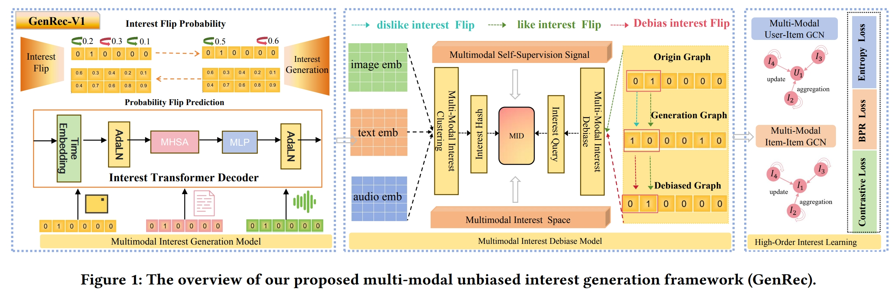

# GenRec-V1| Flip is Better than Noise: Unbiased Interest Generation for Multimedia Recommendation

<!-- PROJECT LOGO -->
 

  

## News
This is the offical code for GenRec-V1(海棠):

>**[ACMMM 2025]** Flip is Better than Noise: Unbiased Interest Generation for Multimedia Recommendation

## Enviroment Requirement
- Python >= 3.8
- Pytorch >=2.0

## Dataset  
Download from Google Drive: [Baby/Sports](https://drive.google.com/drive/folders/13cBy1EA_saTUuXxVllKgtfci2A09jyaG?usp=sharing)  
The data comprises text and image features extracted from Sentence-Transformers and CNN.  

## How to run
1. Place the downloaded data (e.g. `TikTok`) into the `Datasets` directory.
2. Execute the following command:  
`nohup python Main.py --data tiktok`  

## Citation
If you find GenRec-V1 useful in your research, please consider citing our [paper].

## Acknowledgement
The structure of this code is inspired by the [MMRec](https://github.com/enoche/MMRec) framework. We acknowledge and appreciate their valuable contributions.