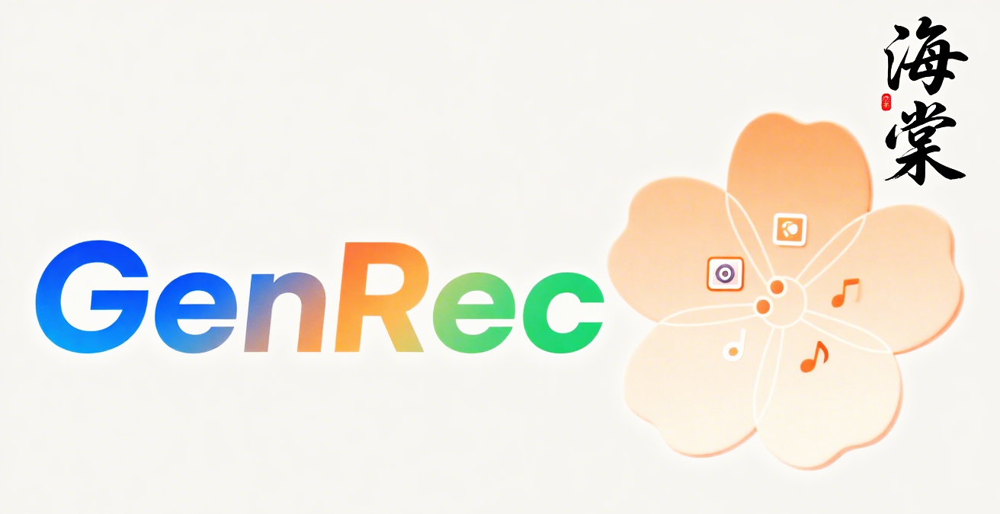

# GenRec-V1| Flip is Better than Noise: Unbiased Interest Generation for Multimedia Recommendation

<!-- PROJECT LOGO -->
<br />
<div align="center">
  <a href="https://github.com/orangeheyue/GenRec-V1">
    
  </a>
</div>

# GenRec-V1 (海棠)

> “试问卷帘人，却道海棠依旧。知否？知否？应是绿肥红瘦。”——李清照《如梦令》

     

## News
This is the official code repository for GenRec-V1 ("Haitang, 海棠"), accompanying our paper: 

>**[ACMMM 2025]** [Flip is Better than Noise: Unbiased Interest Generation for Multimedia Recommendation](https://dl.acm.org/doi/pdf/10.1145/3746027.3755743)


## 🌟 Key Highlights​
- Introduces a novel Flip way for Interest Generation framework for unbiased multimedia recommendation​
- Achieves state-of-the-art performance on TikTok and Amazon-Sports datasets across multiple metrics​
- Integrates high-order interest learning (GCNModel) and multimodal interest clustering (MultimodalCluster)

## 📊 Experimental Results
| Dataset       | Metric     | MF-BPR | NGCF  | LightGCN | SGL   | NCL   | HCCF  | VBPR  | LGCN-M | MMGCN | GRCN  | LATTICE | CLCRec | MMGCL | SLMRec | BM3   | DiffMM | GenRec |
| ------------- | ---------- | ------ | ----- | -------- | ----- | ----- | ----- | ----- | ------ | ----- | ----- | ------- | ------ | ----- | ------ | ----- | ------ | ------ |
| TikTok        | Recall@20  | 0.0346 | 0.0604| 0.0653   | 0.0603| 0.0658| 0.0662| 0.0380| 0.0679  | 0.0730| 0.0804| 0.0843   | 0.0621  | 0.0799| 0.0845  | 0.0957| 0.1129  | 0.1165  |
| TikTok        | Precision@20| 0.0017 | 0.0030| 0.0033   | 0.0030| 0.0034| 0.0029| 0.0018| 0.0034  | 0.0036| 0.0036| 0.0042   | 0.0032  | 0.0037| 0.0042  | 0.0048| 0.0056  | 0.0058  |
| TikTok        | NDCG@20    | 0.0030 | 0.0238| 0.0282   | 0.0238| 0.0269| 0.0267| 0.0134| 0.0273  | 0.0307| 0.0350| 0.0367   | 0.0264  | 0.0326| 0.0353  | 0.0404| 0.0456  | 0.0492  |
| Amazon-Sports | Recall@20  | 0.0430 | 0.0695| 0.0782   | 0.0779| 0.0765| 0.0779| 0.0582| 0.0705  | 0.0638| 0.0833| 0.0915   | 0.0651  | 0.0875| 0.0829  | 0.0975| 0.1017  | 0.1062  |
| Amazon-Sports | Precision@20| 0.0023 | 0.0037| 0.0042   | 0.0041| 0.0040| 0.0041| 0.0031| 0.0035  | 0.0034| 0.0044| 0.0048   | 0.0035  | 0.0046| 0.0043  | 0.0051| 0.0054  | 0.0056  |
| Amazon-Sports | NDCG@20    | 0.0202 | 0.0318| 0.0369   | 0.0361| 0.0349| 0.0361| 0.0265| 0.0324  | 0.0279| 0.0377| 0.0424   | 0.0301  | 0.0409| 0.0376  | 0.0442| 0.0458  | 0.0478  |


## 📁 Code Structure
```plaintext
├── images/               # Project visualization assets and figures
├── datasets/             # Dataset directory (TikTok, Baby, Sports)
├── Main.py               # GenRec model training pipeline
├── Model.py              # GenRec model architecture:
│   ├── FlipInterestDiffusion (Multi-Modal Interest Generaction Module)
│   ├── GCNModel (Multi-modal High-Order Graph Learning Optimization) 
│   └── Multimodal feature encoders
├── Params.py             # Hyperparameter configuration and path management
├── interest_cluster.py   # Interest processing modules:
│   ├── MultimodalCluster (Multi-modal Interest Clustering Space)
│   └── InterestDebiase   (Multi-Modal Interest Debiase Module)
└── README.md           
```

## 🚀 Quick Start​
### Data Preparation​
1. tiktok: 
The tiktok dataset is already ready in ./datasets/tiktok/ for quick start.
1. baby: 
If you want to use baby dataset, please unzip ./datasets/baby/image_feat.npy.zip
1. sports: 
Due to the network limition of big file, sports dataset available on Google Drive: https://drive.google.com/file/d/1PR_IK5-xMwSso2JPHZ93k3eMQ0_s9JDx/view?usp=share_link
[TikTok/Baby/Sports](https://arxiv.org/abs/2406.11781)

To ensure a fair comparison, we conduct our experiments based on the research work of the University of Hong Kong team on DiffMM, adopting the open dataset and preprocessing method they provided. 
This dataset is referenced from DiffMM: Multi-Modal Diffusion Model for Recommendation (ACM MM 2024 Oral). We sincerely appreciate the outstanding contributions made by the DiffMM team to the research in the field of multimodal recommendation systems. 


### Usage
1. Place the downloaded data (e.g. `TikTok/Sports`) into the `Datasets` directory.
2. Execute the following basic command:  
- `python Main.py --data tiktok`  
- `python Main.py --data Sports`  


## Enviroment Requirement
- Python >= 3.8
- PyTorch >= 2.0
- scipy==1.9.1
- scikit-learn >= 1.2.0
- numpy >= 1.24.0
  

## Citation
If you find GenRec-V1 useful in your research, please consider citing our [GenRec-V1].
```bibtex
@inproceedings{he2025flip,
  title={Flip is Better than Noise: Unbiased Interest Generation for Multimedia Recommendation},
  author={He, Yue and Xie, Jingxi and Li, Fengling and Zhu, Lei and Li, Jingjing},
  booktitle={Proceedings of the 33rd ACM International Conference on Multimedia},
  pages={6298--6306},
  year={2025}
}
```

## 📧 Contact​
🌸🌸🌸🌸
GenRec-v1 is an all-new generative multimodal recommendation algorithm. Version 1 is named "Haitang, 海棠" (referring to the Chinese flowering crabapple), a name inspired by the moment we witnessed Haitang flowers in full bloom at 4 a.m. during our research process. Looking ahead, we will continue to iterate on the GenRec series, so stay tuned!
💐💐💐💐
We sincerely hope that GenRec-V1(海棠) can provide as much assistance as possible for your research work. We also warmly welcome you to further develop based on the GenRec framework and jointly explore the frontiers of generative multimodal recommendation technology with us. 
For questions or issues, please contact [orangeai-research@gmail.com, orangeheyue@gmail.com]
