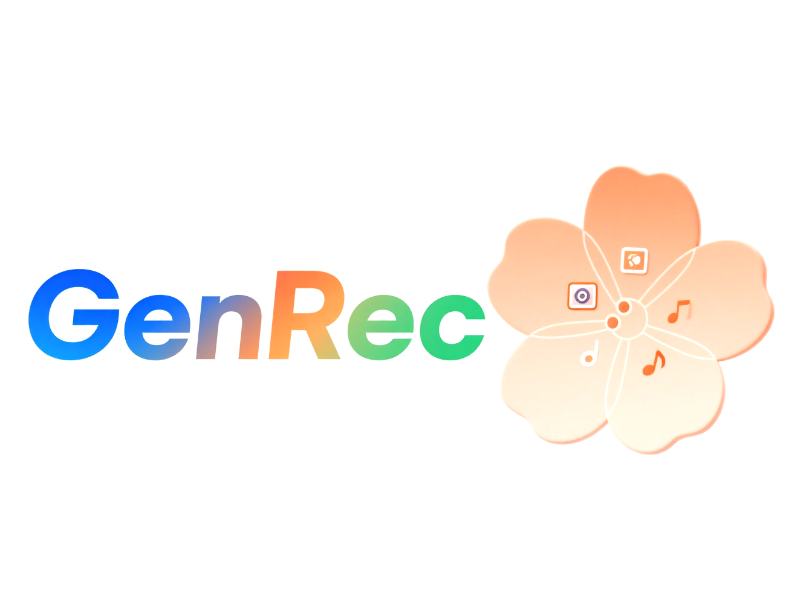

# GenRec-V1| Flip is Better than Noise: Unbiased Interest Generation for Multimedia Recommendation

<!-- PROJECT LOGO -->
 

  

## News
This is the offical code for GenRec-V1(海棠):

>**[ACMMM 2025]** Flip is Better than Noise: Unbiased Interest Generation for Multimedia Recommendation

## Enviroment Requirement
- Python >= 3.8
- Pytorch >=2.0

## Code
├── images // Storage for project-related image resources, used for visual displays, interface elements, etc.
├── Main.py // The main entry point of the project, responsible for scheduling and integrating the GenRec diffusion model processes, which is key to starting the core logic
├── Model.py // Model layer, containing algorithmic logic and network architectures (core models: FlipInterestDiffusion, high-order interest learning GCNModel, etc.)
├── Params.py // Centralized management of project parameters for easy configuration and adjustment, such as model hyperparameters and path settings
├── README.md // Project documentation; what you're reading is based on this, used to explain project functionalities, usage methods, etc. to users
└── interest_cluster.py // Functions related to interest clustering (MultimodalCluster) and interest debiasing module (InterestDebiase), facilitating data grouping and precise capture of user interests

## Dataset  
Download from Google Drive: [TikTok/Baby/Sports](https://drive.google.com/drive/folders/13cBy1EA_saTUuXxVllKgtfci2A09jyaG?usp=sharing)  
The data comprises text and image features extracted from Sentence-Transformers and CNN.  

## How to run
1. Place the downloaded data (e.g. `TikTok`) into the `Datasets` directory.
2. Execute the following command:  
`nohup python Main.py --data tiktok`  

## Citation
If you find GenRec-V1 useful in your research, please consider citing our [paper].

